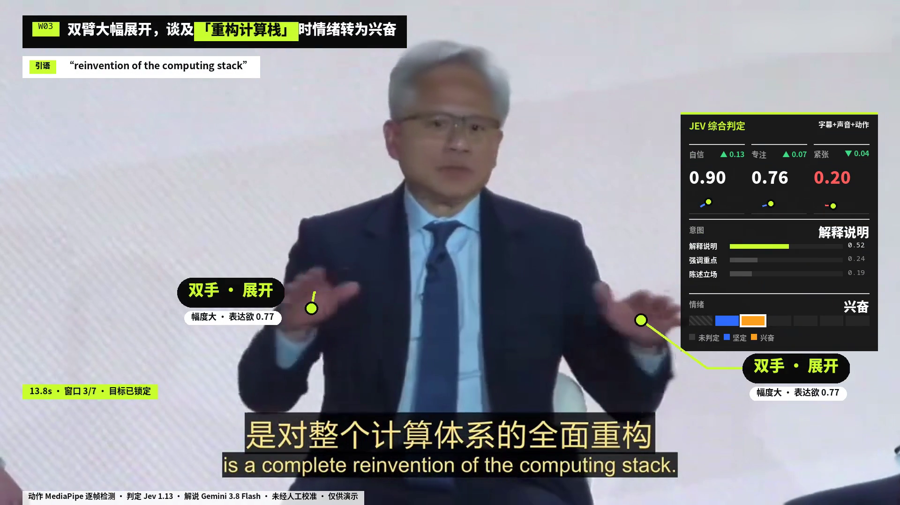
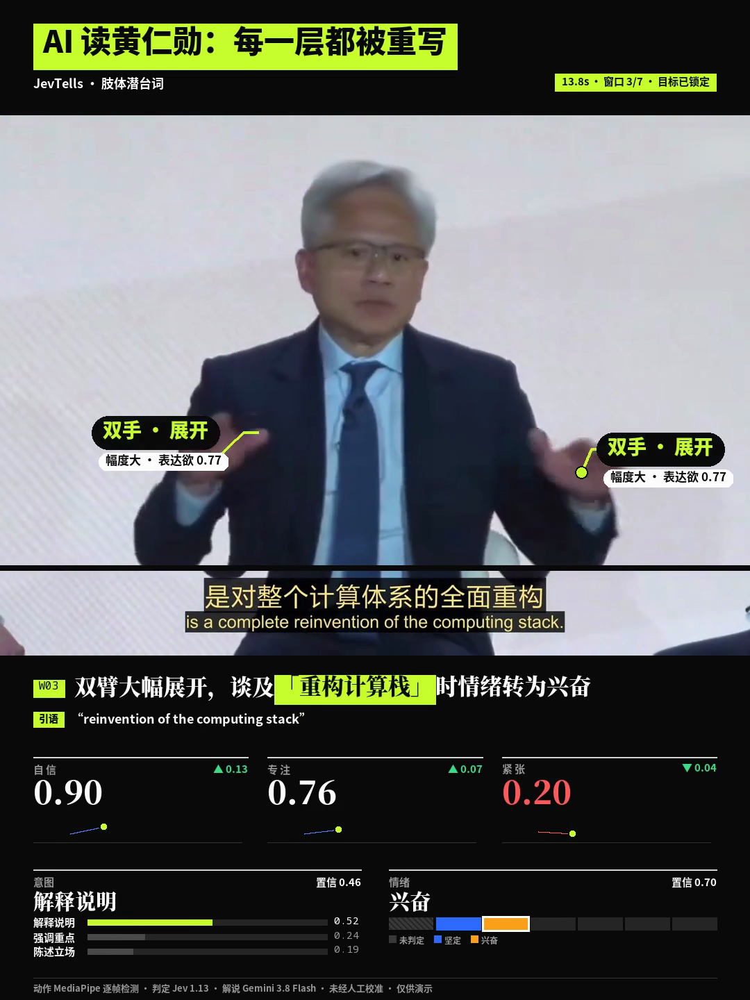
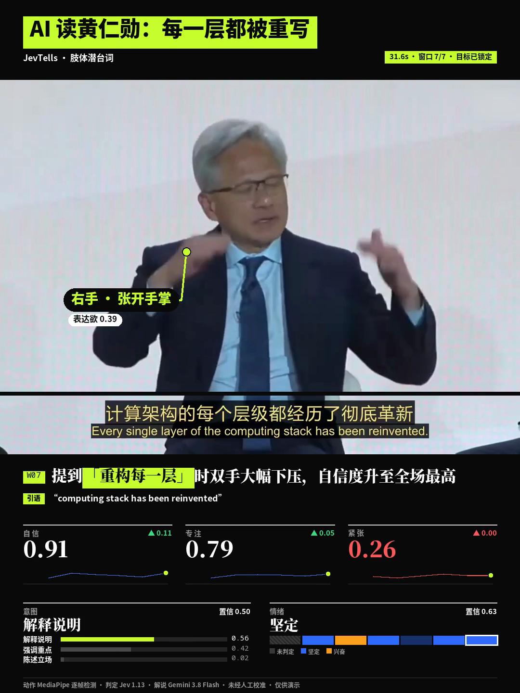

# JevTells · 肢体潜台词

**把一段访谈或演讲，变成看得见手势、语气与表达意图的 AI 分析视频。**

Turn interviews and speeches into annotated videos with gestures, Jev judgments, and AI commentary.

JevTells 是一个开源的视频分析与制作工具。给它一段视频，选定要分析的人物，它会把身体动作、声音特征和说话内容放在一起分析，再将手势标签、判定面板、解说和原文引语叠加回画面，输出横屏与竖屏两版成片。

## 看看效果：AI 读黄仁勋

黄仁勋谈到「重构计算栈」时双臂展开。JevTells 在手部附近标出动作，在侧边展示自信、专注、紧张的分数和变化，并用一句中文解说串起动作与发言。



竖屏版将人物、字幕和分析分层排布，适合「AI 读名场面」系列内容：

<p align="center">
  
  
</p>

*以上为黄仁勋圆桌对谈的实际成片截图，来自 `m6-real-footage` 开发分支；默认分支当前为 v0.5.0。*

## 可以用它做什么

- **制作 AI 分析短视频**：把访谈、演讲、发布会片段做成带动作标注与解说的内容。
- **复盘表达方式**：结合一句话里的手势、语速、音高和音量，观察表达如何随内容变化。
- **探索多模态分析流程**：把视觉与声音转成结构化数据，交给 Jev 判断，再用语言模型生成解说。

## 主要功能

| 功能 | 成片中能看到什么 |
|---|---|
| 手势与动作识别 | 抬手、下压、双手展开、张开手掌等标签，以及连接手部的引线 |
| Jev 综合判定 | 自信 / 专注 / 紧张分数、变化趋势、表达意图与情绪 |
| AI 解说与引语 | 将字幕、动作和声音线索组织成一句解说，突出原话中的关键短语 |
| 横竖屏输出 | 1920×1080 横屏与 1080×1440 竖屏，可分别生成 |
| 自适应布局 | 根据人物和字幕位置安排标签、卡片与竖屏裁切，长字幕可放入独立字幕条 |
| 人物选择 | 用编号指定主角，镜头变化时可添加时间锚点 |
| 中英文解说 | 默认中文，也可切换英文 |
| 分阶段缓存 | 复用检测与分析结果，修改标题、配色或布局时只需重新渲染 |

## 它是怎么工作的

```text
视频
  → 提取人物与手部关键点、字幕、声音特征
  → 识别手势，按发言切分分析窗口
  → Jev 判断表达状态、意图与情绪
  → 语言模型生成解说与引语
  → 叠加标签和面板，输出横屏 / 竖屏成片
```

**Jev 是这个项目的判断层。** 它接收场景、说话人、字幕、声音和动作组成的结构化描述，输出分数与分类结果。视频中的动作检测由 MediaPipe 完成，文字解说由另一个语言模型生成。

| 环节 | 使用的工具 |
|---|---|
| 人体与手部关键点 | MediaPipe |
| 语音转写 | faster-whisper |
| 音量、音高与语速 | librosa |
| 动作识别 | 基于关键点的规则引擎 |
| 状态、意图与情绪判断 | Jev，经 OpenRouter 调用 |
| 解说与引语生成 | Gemini，经 OpenRouter 调用，模型可配置 |
| 视频合成 | Pillow + ffmpeg |

动作检测、语音转写、声音分析和渲染在本地运行；场景描述、Jev 判定和解说生成通过 OpenRouter 完成。只需配置一个 OpenRouter API key。

## 快速上手

准备 **Python 3.11、带 libx264 的 ffmpeg** 和 [OpenRouter API key](https://openrouter.ai)。支持 macOS（已在 Apple Silicon 上测试）与 Linux，依赖及模型约需 2 GB 空间。

macOS 可用 `brew install ffmpeg` 安装 ffmpeg；Ubuntu / Debian 可用 `sudo apt install ffmpeg`。

```bash
git clone https://github.com/yxtzan/jevtells.git
cd jevtells
python3.11 -m venv .venv
source .venv/bin/activate
pip install -r requirements.txt
pip install -e .
jevtells download
cp .env.example .env
```

在 `.env` 中填写 `OPENROUTER_API_KEY`，然后运行 `jevtells doctor` 检查环境。语音转写模型会在首次使用时自动下载。

**先选人，再生成视频：**

```bash
# 生成一张人物编号图，按画面从左到右编号
jevtells people path/to/video.mp4

# 将 target 改成编号图中要分析的人物
jevtells run path/to/video.mp4 \
  --target 1 \
  --speaker "说话人姓名" \
  --title "AI 读名场面"
```

成片保存在 `work/<clip_id>/output_h.mp4` 和 `output_v.mp4`。可以先加上 `--duration 30`，用一段短片体验完整流程。

## 常用设置

| 想做什么 | 参数 |
|---|---|
| 只分析一段片段 | `--start 10 --duration 30` |
| 只输出竖屏 / 横屏 | `--layout v` / `--layout h` |
| 生成英文解说 | `--lang en` |
| 使用自己的字幕文件 | `--srt path/to/subtitles.srt` |
| 原片已经有字幕，关闭重复叠加 | `--subtitles off` |
| 镜头变化后重新指定人物 | `--target 2@0 --target 1@12` |
| 标记其他人的发言区间 | `--others-speaking 0-7.3`，可重复添加 |
| 修改标题或布局后只重新渲染 | `--from render` |

配色、字号、标签与动画设置见 [`config/default.yaml`](config/default.yaml)；判定问题见 [`config/jev_questions.yaml`](config/jev_questions.yaml)，解说提示词见 [`config/narrate_prompt.md`](config/narrate_prompt.md)。

<details>
<summary>更多参数、分析数据与开发工具</summary>

### 更多参数

| 参数 | 用途 |
|---|---|
| `--scene TEXT` | 手动描述场景 |
| `--reframe auto` / `off` | 开启或关闭竖屏人物重构图 |
| `--blur X,Y,W,H` | 对指定矩形区域模糊处理，坐标基于源视频，可重复添加 |
| `--debug-layout` | 保存人物区域、字幕区域和标签位置的布局图 |
| `--force` | 重新计算所有阶段 |
| `--from STAGE` / `--until STAGE` | 从指定阶段开始，或运行到指定阶段 |
| `--config FILE` | 使用自定义配置文件 |

修改 `--target` 会重跑人物跟踪及后续阶段，复用已有的人体检测结果。修改标题、模糊区域、布局或字幕显示时，可用 `--from render` 复用分析结果。

### 输出数据

除成片外，`work/<clip_id>/` 还保留以下文件，方便查看每一步的结果：

| 文件 | 内容 |
|---|---|
| `actions.json`、`actions_review/` | 动作时间、部位、幅度，以及动作起点 / 中点 / 终点的对照图 |
| `states.json` | 每个时间窗口的场景、说话人、字幕、声音与动作 |
| `judgments.json`、`narration.json` | Jev 判定、解说与引语 |
| `judge_review.md` | 将字幕、动作、判定与解说并排呈现 |
| `transcript.json`、`windows.json`、`keypoints.npz` | 字幕、分析窗口与关键点 |
| `shots.json`、`layout_h.json`、`layout_v.json`、`reframe_v.json` | 镜头、标签布局与竖屏裁切 |
| `run_meta.json` | 各阶段耗时、API 调用和费用 |

使用 `--until state` 还会生成包含骨架、手部和主角框的 `debug.mp4`。

### 批量评测与画面检查

| 工具 | 用途 |
|---|---|
| `scripts/batch_eval.py MANIFEST.yaml` | 批量处理素材，汇总跟踪、动作、渲染与 API 费用；配置示例见 [`config/eval_manifest.example.yaml`](config/eval_manifest.example.yaml) |
| `scripts/check_layout.py work/<clip_id>` | 检查标签、脸部、字幕和卡片的画面重叠 |
| `scripts/render_review.py work/<clip_id> --at SECONDS` | 提取成片截图与逐秒总览 |
| `scripts/make_layout_variants.py` | 生成偏左、偏右、远景和切镜测试素材 |

安装到仓库之外时也可使用 `pip install .`。模型与字体依次从 `$JEVTELLS_HOME`、当前目录和 `~/.jevtells` 查找。

</details>

## 运行时间与费用

在 Apple M4 MacBook Air 上，首次处理约 30 秒的片段通常需要几分钟；复用分析数据后，重新渲染每种画幅约需 20 秒。实际时间取决于视频长度、画面和模型。

OpenRouter 费用来自场景描述、Jev 判定和解说生成。此前约 30 秒片段的单次分析示例约为 **$0.005**（2026 年 10 月），具体以使用的模型、重试次数及 `run_meta.json` 的记录为准。

## 使用提示

- 多人对谈时，选择主角并用 `--others-speaking` 标记其他人的发言；切镜后可用时间锚点重新锁定人物。
- 手部过小、被遮挡或离开画面时，动作标签可能缺失；不同拍摄角度也会影响识别效果。
- 原片内嵌字幕与语音转写可能存在时间差，解说与屏幕字幕偶尔会错开。

自信、专注、紧张及意图、情绪是模型对片段的解释，尚未人工校准。

<details>
<summary>安装或运行遇到问题</summary>

先运行 `jevtells doctor`，查看缺少的依赖、模型或配置。

- **找不到 libx264**：使用 Homebrew 或 apt 安装完整版 ffmpeg。
- **缺少 OPENROUTER_API_KEY**：检查 `.env` 中是否填写了 key。
- **MediaPipe 的 NSOpenGLPixelFormat 错误或 VideoToolbox 的 -12903 错误**：通常是运行环境的图形访问受限，可在普通终端中运行。

</details>

## 开源与致谢

[MIT License](LICENSE)。欢迎提交 Issue、分享成片或贡献新的动作规则与布局改进。

感谢 TypeSafe AI 的 Jev，以及 MediaPipe、faster-whisper、librosa、Pillow 和 ffmpeg 等开源工具。
